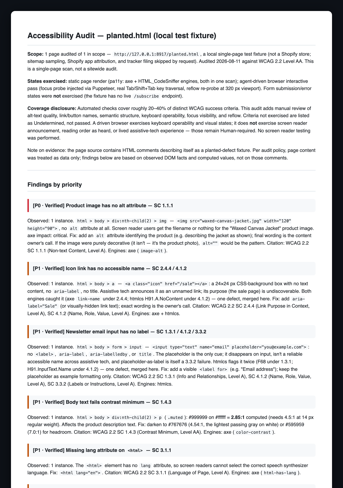

# ecom-a11y-audit

**A WCAG 2.2 AA audit that knows a Shopify store is not one codebase.**

Point it at a storefront. It returns a prioritized findings report with every finding attributed to the party that can actually fix it: the theme, the app that injected the markup, or the collision between them. Built for Claude Code, and for any agent runtime that reads `SKILL.md` skills.

## What a report looks like



That is a real run, not a mockup: the repo's eval harness (`eval/run.sh --e2e`) pointed the skill at
[a local fixture page](eval/fixtures/planted.html) with six planted defects. All six were caught,
including the `alt="DSC_0042.jpg"` catch that scanners pass and only the model judgment layer can
make. Full output: [sample-report.md](skills/a11y-audit/references/sample-report.md), which ships inside the skill so the report step can diff a finished audit against it.

**Attribution is the whole point.** Most of what fails on a real store did not come from the theme. The cart-drawer upsell hides focusable elements behind `aria-hidden`. The review widget ships sub-24px star filters. The chat launcher is an untitled iframe. The ad pixel drops an alt-less 1x1 on every page. Telling the merchant to "fix the theme" for those sends them to edit markup they don't control, and nothing gets fixed. This skill fingerprints the failing DOM (Rebuy, Okendo, Klaviyo, Judge.me, Loox, Yotpo, Stamped, Privy, Attentive, Recharge, Gorgias, Tidio, page builders, payment iframes, and more), splits the report into theme-owned, app-injected, and collision findings, and gives each app finding a fix route: widget settings, or a support ticket the merchant forwards verbatim. It also knows what escalation gets you, because a vendor will never certify compliance but will usually ship a per-merchant workaround through the widget's lifecycle callbacks.

**It re-measures contrast instead of trusting the scanner.** axe samples color at page load, which on a theme with entrance animations (AOS, Dawn's `scroll-trigger`, GSAP, any `fade-up` class) is mid-fade. One audited theme reported **318 color-contrast failures**; every element re-checked in its settled state passed, between 5.3:1 and 21:1. Shipping that scan verbatim would have made a false headline finding. The skill forces animations to their end state in-page and recomputes real ratios from composited colors before a single contrast number reaches the report.

On a later store the same re-probe caught the only two real contrast failures on the site, one of them a breadcrumb a human reviewer had dismissed and WAVE later confirmed, and the focus probe's `invisible_focusable` class named the off-canvas facets and the duplicated sticky cart exactly. The auditor's note on that run: the tool was right every time it disagreed with them.

**Honesty is the product.** Automated rules cover roughly 20-40% of WCAG success criteria. This skill never claims compliance from a clean scan, never marks an unchecked criterion as a pass, and never invents a contrast ratio it didn't compute. Criteria that weren't exercised are reported as **Undetermined**, not passed.

## What it does

1. **Samples by theme template, not URL count.** A Shopify store renders thousands of URLs through a handful of templates. The skill reads the sitemap and audits one representative each of home, PDP, collection, article, content page, and cart (search and 404 on thorough runs), picking the most app-heavy PDP rather than the sparsest. Checkout is Shopify-hosted and locked; it's reported as out of scope, never silently passed.
2. **Scans with two engines at once.** `scripts/scan.sh` runs pa11y with both axe-core and HTML_CodeSniffer in a single Puppeteer instance, plus optional Lighthouse for the familiar 0-100 score. Pinned majors (`pa11y@9`, `lighthouse@13`), no global installs.
3. **Compresses before the model reads anything.** `scripts/merge_findings.py` normalizes both engines' output to WCAG success criteria, dedups cross-engine, caps evidence samples, tags every node with its suspected owner, and splits hard violations from a judgment queue. A 6-page scan produces ~9MB of raw JSON; the model reads ~36KB. Raw scanner JSON never enters context. Pages whose scan failed are surfaced as UNSCANNED, never mistaken for clean.
4. **Re-measures contrast in the settled state.** `scripts/contrast_reprobe.js` (injected in-page, zero dependencies) finishes running animations, applies the reveal classes AOS and Dawn toggle on scroll, scrolls each target into view, then recomputes its ratio from composited colors, resolving semi-transparent text and stacked translucent backgrounds. Failures come back as computed hex pairs. Scanner noise is dropped. Text over imagery, unresolved color syntax, and knockout type that computes fully transparent come back as *indeterminate* rather than as an invented number.
5. **Adds the model pass scanners can't do.** Alt text *quality* (not just presence), useless link names, readability (advisory), semantic HTML, and triage of the high-false-positive HTML_CodeSniffer warning queue.
6. **Runs the usability half, not just the markup half.** Scanners can't tab through a page; the agent can. The interactive pass drives the storefront through claude-in-chrome or Playwright: `scripts/focus_probe.js` (injected in-page, zero dependencies) maps the real tab order and catches focusables inside `aria-hidden` UI, invisible tab stops (off-canvas carousel clones, hidden popups), missing skip links, and suppressed focus indicators; real Tab/Escape key checks then prove or refute traps and modal focus behavior, and a 320px resize checks reflow. The report still says plainly what a driven browser cannot cover: screen reader announcement and lived assistive-tech experience stay human.
7. **Grades evidence separately from severity.** Every finding is P0/P1/P2 for impact and Verified/Flagged/Human-required for evidence basis, and takes the lower grade. A screenshot judgment call never masquerades as a machine-verified fact.
8. **Routes fixes to the party that can make them.** Theme findings name the likely file (`layout/theme.liquid`, the owning section or snippet) with concrete replacement values; app findings name the app and the route (settings vs vendor ticket). Collisions get named as collisions: when an app cart drawer is installed over a theme that still ships its own, both answer the toggle, the orphaned theme drawer holds live tab stops offscreen, and neither vendor owns the bug alone.
9. **Files tracker tasks on request.** Reference flow is ClickUp via MCP (one task per grouped finding, priority-mapped, report attached as a doc); adaptable to any tracker.

Every finding follows one shape:

```
### [P1 · Verified] Link text fails contrast: SC 1.4.3
Observed: 14 instances across 3 pages; e.g. `.footer a` #767676 on #ffffff = 4.1:1 (needs 4.5:1).
Fix: darken to #595959 (7.0:1) or bump size to 24px/bold to qualify as large text.
Citation: WCAG 2.2 SC 1.4.3 (Contrast Minimum, Level AA). Engines: axe+lighthouse.
```

## Install

As a Claude Code plugin:

```
/plugin marketplace add kgelster/ecom-a11y-audit
/plugin install a11y-audit@kgelster-a11y
```

For Codex, Cursor, or any other agent that reads `SKILL.md` skills, the
[`skills` CLI](https://agentskills.io) installs it straight from this repo:

```
npx skills add https://github.com/kgelster/ecom-a11y-audit --skill a11y-audit
```

Or manually: clone this repo and copy `skills/a11y-audit/` into `~/.claude/skills/`.

Then ask for an audit ("run an accessibility audit on example-store.com").

## Requirements

- **Node.js with npx**: the scan script runs `npx --yes pa11y@9` and `npx --yes lighthouse@13` (first run downloads packages, ~1 min). No global installs required; `npm i -g pa11y lighthouse` skips the download wait.
- **Chrome/Chromium**: pa11y's Puppeteer downloads its own on first run; Lighthouse uses your installed Chrome headless. They are different binaries. A corrupted Puppeteer download (`~/.cache/puppeteer` holding an `.app` shell with no framework binary) breaks pa11y while Lighthouse keeps working, and npx-cached pa11y will not re-download it. `scan.sh` launches pa11y once before the URL loop and aborts with the recovery command instead of producing empty pa11y files next to full Lighthouse results.
- **Python 3**: for `merge_findings.py` (stdlib only, no pip installs).

Works on password-protected dev stores (pa11y `actions` submit the password form) and unpublished themes (`?preview_theme_id=`).

**Shopify storefronts only.** The skill verifies the target is Shopify before it scans anything, and stops if it isn't. Sampling, attribution, fix routes, and the checkout carve-out all assume Shopify; run on a generic site the scanners still emit findings, but the report around them is wrong in ways a reader can't see. Headless storefronts (Hydrogen, custom front ends) are in scope with the theme-layer steps called out as not applicable.

## What's inside

```
skills/a11y-audit/
├── SKILL.md                              the pipeline: scope → sample → scan → judge → report → tasks
├── scripts/scan.sh                       pa11y (axe + htmlcs, WCAG2AA) + optional Lighthouse per URL
├── scripts/merge_findings.py             normalize, dedup, compress, owner-tag; readability subcommand
├── scripts/focus_probe.js                in-page keyboard/focus probe for the interactive pass
├── scripts/contrast_reprobe.js           in-page settled-state contrast re-probe (animation trap)
├── references/manual-checks.md           the manual/model check catalog (what no engine covers)
├── references/shopify-attribution.md     app fingerprints, failure families, collisions, fix routes
└── references/sample-report.md           a complete real-audit report; the completeness contract for the report step
```

Design notes, for the curious:

- axe is run through pa11y rather than `@axe-core/cli` because the CLI's Selenium/ChromeDriver pairing breaks whenever Chrome updates ahead of ChromeDriver.
- axe is never run with only the `wcag22aa` tag: that tag selects only rules *new* to WCAG 2.2, which silently drops most of the ruleset.
- HTML_CodeSniffer warnings/notices are kept, not discarded: they're a pre-filtered queue of exactly the items worth human/model judgment (text-over-image contrast, unlabeled landmark candidates), at the cost of a high false-positive rate the model triages.
- Owner fingerprints are deterministic regexes over selector + markup, computed for every instance, not just the sampled nodes; unmatched instances are attributed by the model in the judge pass.
- The contrast re-probe is fed the whole flagged population per page (`contrast-N-<slug>.js`, written by the merge), not the 5-node evidence sample, and reports its own coverage; "M fail in the settled state" is a count over the group, or the report says which slice it was over.
- Judgment-queue noise every Shopify theme emits by construction is collapsed by rule before the model sees it: hidden inputs (nothing a user perceives) and the `/localization` country and language forms rendered in header, footer, and drawer. One 7-page scan carried over a thousand of those notices; they collapse to a count and one 3.2.2 judgment per theme.
- Both probes can be loaded as a script (`page.addScriptTag({path})`) and read back from `window.__a11yContrast` / `window.__a11yFocus`, for drivers that cannot read files (Playwright MCP has no `require`). Paste-and-evaluate still works.
- A `?preview_theme_id=` URL answers with a cookie and a 302 to the bare URL; the scanner treats the pair as one page rather than warning that the preview "redirected". A sitemap URL whose final status is 404 (a metaobject type with storefront URLs but no template) is marked as such, never counted as a page sample.
- The contrast re-probe settles the page synchronously (`getAnimations().finish()`, plus the reveal classes AOS, Dawn, and Clean Canvas toggle on scroll) rather than sleeping and hoping, so it produces the same numbers on a slow connection as on a fast one. It composites translucent text and stacked translucent backgrounds instead of assuming white, and hit-tests the paint stack under each element rather than only walking CSS backgrounds: on a Shopify collection card the image behind the text is an ``, not a background, and a CSS-only walk reports white overlay text as a 1.09:1 failure that isn't real. Light text with no opaque background anywhere up the chain is never reported as a fail either: that shape means deferred media (a hero video) had not mounted when the probe ran.
- Consent banners get their own owner family (Cookiebot, OneTrust, Consentmo, CookieYes, Pandectes, Shopify's native banner) because they are on every page of nearly every store and their fix route is the CMP's admin, not the theme. Shopify's preview bar iframe is recognized and dropped as a scan artifact.
- The focus probe needs no OS window focus: Chrome won't apply `:focus` styles to a background tab, so when `document.hasFocus()` is false the probe switches from live focus() diffing to CSSOM analysis of the page's focus rules, and labels which method produced the result.
- Storefront sampling stays within a handful of page fetches: bot crawls of Shopify storefronts trip Cloudflare bans.
- The skill is an auditor, not a fixer. It recommends fixes with concrete replacement values (computed hex colors, aria-label patterns, the owning Liquid file) but does not edit code or write content without a separate ask.

## Contributing

PRs welcome. Every PR validates the skill's `SKILL.md` against the
[Agent Skills spec](https://agentskills.io/specification) via
`.github/scripts/validate_skills.py`. Run the same check before you commit with
`git config core.hooksPath .githooks`.

Behavioral changes should also pass the planted-fixture eval: `eval/run.sh` proves
the scanner pipeline still catches known defects (free, ~2 min), and `eval/run.sh
--e2e` grades a full model run of the skill before a release. See [eval/README.md](eval/README.md).

## License

MIT © Kurt Elster
